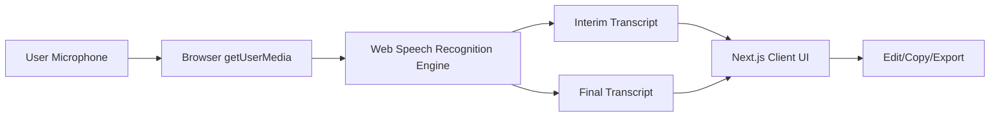

# Voice Note — Realtime Speech-to-Text Web Application

## 1) Project Overview
Production-ready, privacy-first real-time speech-to-text application built with Next.js App Router and TypeScript. It captures microphone input and transcribes speech live using the browser Web Speech API (real-time partial + final results), then allows transcript editing and export.

## 2) Features
- Premium welcome page with glossy black visual style
- Dedicated transcription dashboard
- Real microphone capture with permission handling
- Real-time interim transcription updates
- Stable finalized transcript accumulation
- Spoken punctuation conversion (comma, full stop, apostrophe, colon, semicolon, single/double quote)
- Start / Pause / Resume / Stop controls
- Live audio level meter
- Editable transcript area
- Copy transcript to clipboard
- Export transcript as TXT and JSON
- New session reset
- Language selection (extensible)
- Accessible status updates and keyboard-usable controls
- Mobile-friendly responsive layout

## 3) Architecture
This release is **frontend-first and stateless** for privacy and Vercel compatibility.



### Deployment Topology
```mermaid
flowchart TB
    V[Vercel Next.js App]
    V --> UI[Frontend UI + Client Speech Logic]
    V --> H[/api/health]
    H --> DB[(PostgreSQL via Drizzle)]
```

## 4) Technology Stack
- Next.js 16 (App Router)
- React 19
- TypeScript (strict)
- Tailwind CSS v4
- Drizzle ORM + PostgreSQL (project baseline/health endpoint)
- Vitest (unit tests)

## 5) Requirements
- Node.js 20+
- npm
- Modern browser with Web Speech API support (best: Chrome/Edge/Safari)
- HTTPS (or localhost) for microphone APIs

## 6) Installation
```bash
npm install
```

## 7) Environment Variables
Create `.env` from `.env.example`:

```bash
cp .env.example .env
```

Variables:
- `DATABASE_URL` (required): PostgreSQL connection string
- `NEXT_PUBLIC_APP_NAME` (optional): branding extension

## 8) Local Development
```bash
npm run dev
```
Open: `http://localhost:3000`

## 9) Speech Provider Setup
### Current implementation
Uses browser-native Web Speech API:
- No external API key required
- No provider secret sent to browser
- Audio remains in browser-to-browser-engine flow

### Why this choice
- Lowest integration complexity for real-time captions
- Excellent latency in supported browsers
- Fully Vercel compatible (no server WebSocket required)

## 10) Testing
Unit tests:
```bash
npx vitest run
```

Core utilities covered:
- Transcript normalization
- Final transcript append stability
- Duration formatting
- JSON export payload structure

## 11) Production Build
```bash
npm run build
npm run start
```

## 12) Vercel Deployment
1. Push repository to Git provider
2. Import project into Vercel
3. Set environment variable:
   - `DATABASE_URL`
4. Deploy

Notes:
- Microphone works only on secure origins (HTTPS). Vercel provides HTTPS by default.
- No speech API secrets are required in this architecture.

## 13) Troubleshooting
- **Permission denied**: allow mic access in browser site settings
- **Unsupported browser**: switch to latest Chrome/Edge/Safari
- **No transcript updates**: verify secure context (https:// or localhost)
- **Intermittent recognition**: app auto-attempts reconnect on dropped recognition sessions

## 14) Browser Compatibility
- Chrome: strong support
- Edge: strong support
- Safari: partial support depending on version
- Firefox: Web Speech recognition support is limited

App performs feature detection and surfaces clear guidance.

## 15) Privacy Considerations
- App does **not store raw audio recordings**
- App does **not persist transcript history** server-side by default
- Session data is client-side in-memory only
- User can clear/reset session anytime

## 16) Security Considerations
- No speech provider secret exposed in `NEXT_PUBLIC_*`
- No raw audio logging
- Minimal server surface area
- Strict TypeScript types for event/state handling
- Sensitive data remains user-controlled in browser session

## 17) If You Need External Provider Streaming Later
For enterprise-grade multi-browser consistency (including Firefox), use:
- Vercel frontend + ephemeral token endpoint
- Managed real-time speech WebSocket provider from browser using short-lived token
- Optional dedicated persistent relay service if provider/browser constraints require it

This repository is structured for that evolution without UI rewrites.